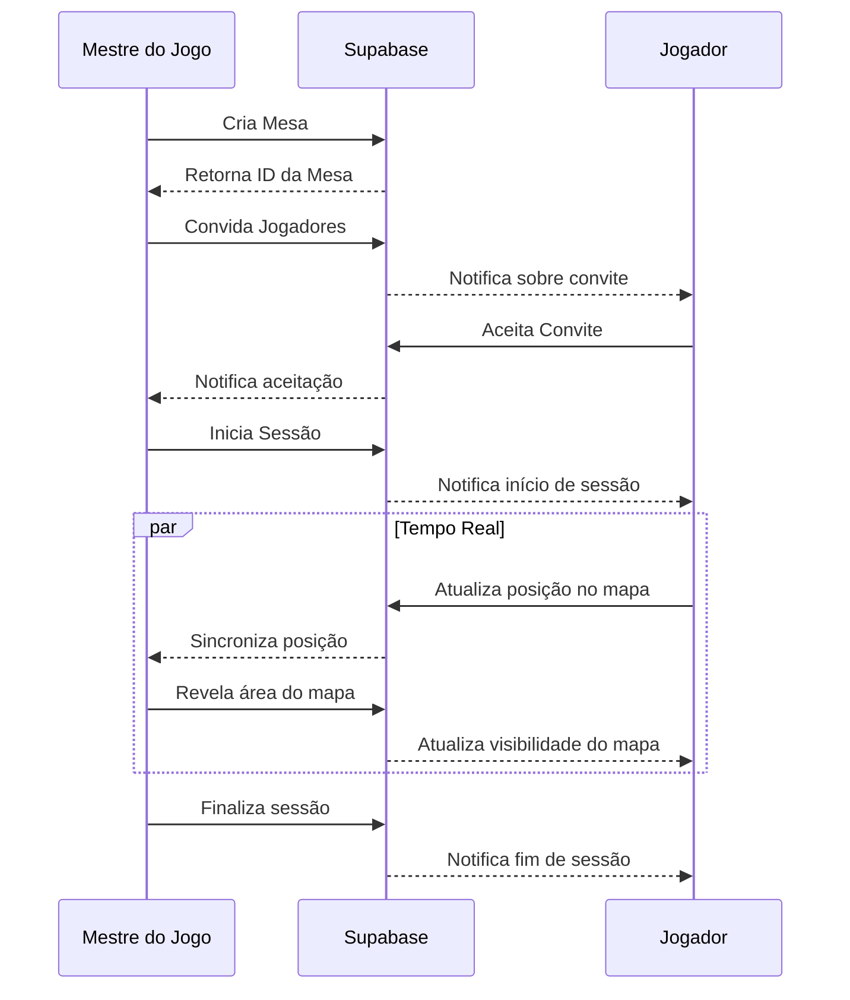
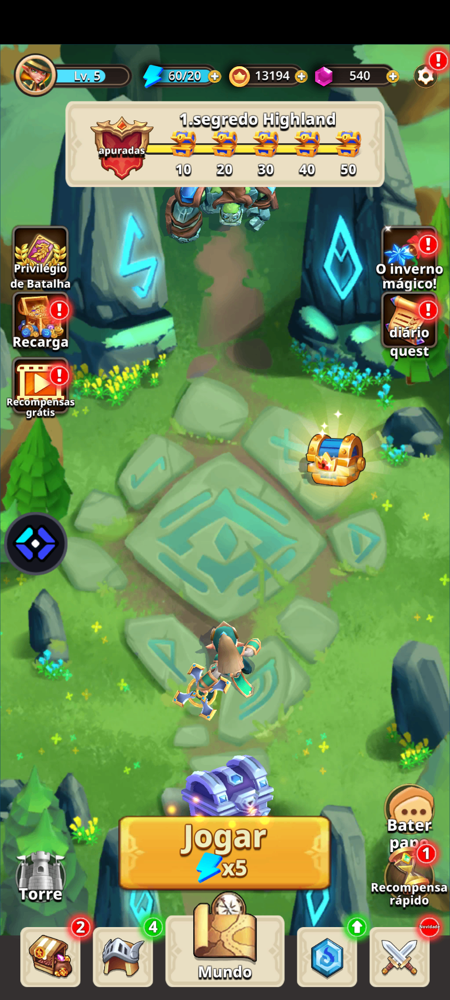
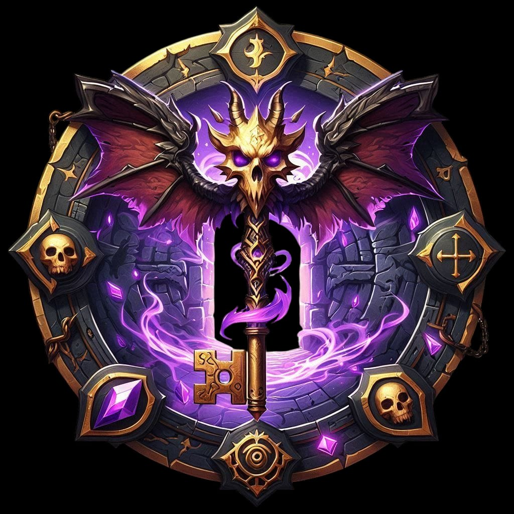
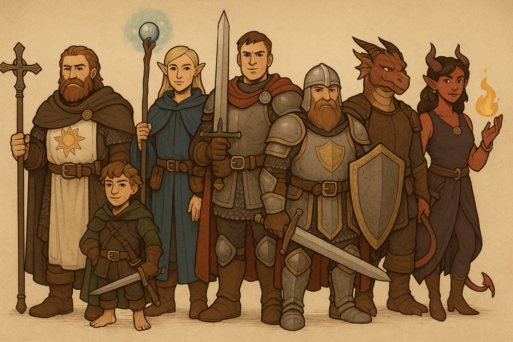
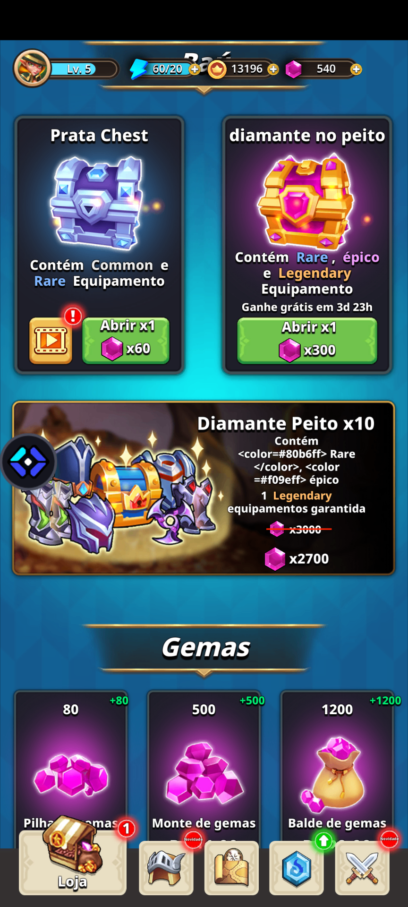
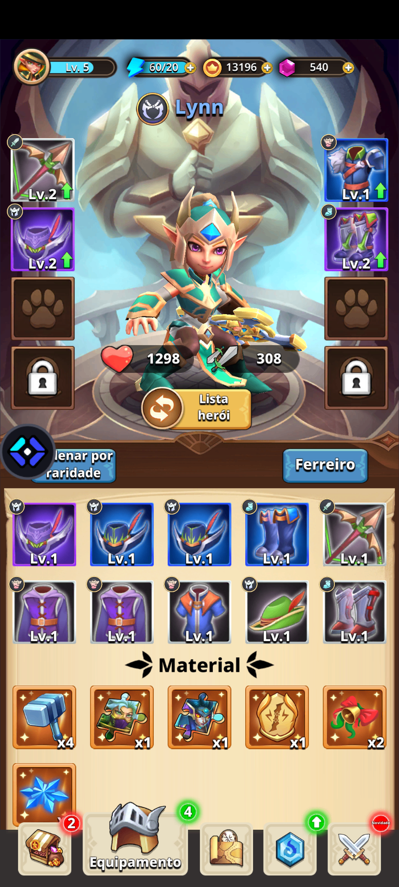

# Dungeon Master Assistant

Uma aplicação web para gerenciamento de campanhas e sessões de RPG de mesa.

## Configuração do Ambiente

### Requisitos
- Node.js v16+ e npm
- Conta no Supabase (para banco de dados e autenticação)

### Configuração das Variáveis de Ambiente

1. Crie um arquivo `.env` na raiz do projeto baseado no `.env.example`:

```
VITE_SUPABASE_URL=https://seu-projeto.supabase.co
VITE_SUPABASE_ANON_KEY=sua-chave-anon-do-supabase
```

2. Substitua os valores pelas suas credenciais do Supabase:
   - `VITE_SUPABASE_URL`: URL do seu projeto Supabase
   - `VITE_SUPABASE_ANON_KEY`: Chave anônima de API do seu projeto Supabase

Você pode encontrar essas informações no painel do Supabase em Configurações do Projeto > API.

### Instalação de Dependências

```bash
# Instalar dependências
npm install

# Iniciar o servidor de desenvolvimento
npm run dev

# Construir para produção
npm run build

# Executar testes
npm run test
```

## Diagrama de Fluxo de Sessões



## Estrutura de Tabelas no Supabase

### Principais Tabelas e Endpoints

| Tabela | Descrição | Endpoint |
|--------|-----------|----------|
| `tables` | Mesas de jogo | `/tables` |
| `table_participants` | Participantes das mesas | `/table_participants` |
| `characters` | Personagens dos jogadores | `/characters` |
| `character_inventory` | Inventário dos personagens | `/character_inventory` |
| `session_tokens` | Tokens no mapa durante sessões | `/session_tokens` |
| `fog_of_war` | Controle de névoa de guerra | `/fog_of_war` |
| `chat_messages` | Mensagens no chat | `/chat_messages` |
| `notifications` | Sistema de notificações | `/notifications` |
| `maps` | Mapas das sessões | `/maps` |
| `stories` | Narrativas e histórias | `/stories` |
| `npcs` | NPCs do mundo | `/npcs` |
| `monsters` | Monstros para combate | `/monsters` |
| `items` | Itens do jogo | `/items` |
| `profiles` | Perfis de usuários | `/profiles` |

## Screenshots das Telas Principais

### Painel do Mestre


### Mapa Tático


### Chat Durante Sessão


### Sistema de Combate


### Inventário


## Funcionalidades Principais

- Gerenciamento de mesas e campanhas de RPG
- Sistema de inventário com drag-and-drop
- Chat em tempo real durante as sessões
- Mapa tático com névoa de guerra
- Notificações de sessões e eventos
- Sistema de combate em turnos

## Licença

MIT
