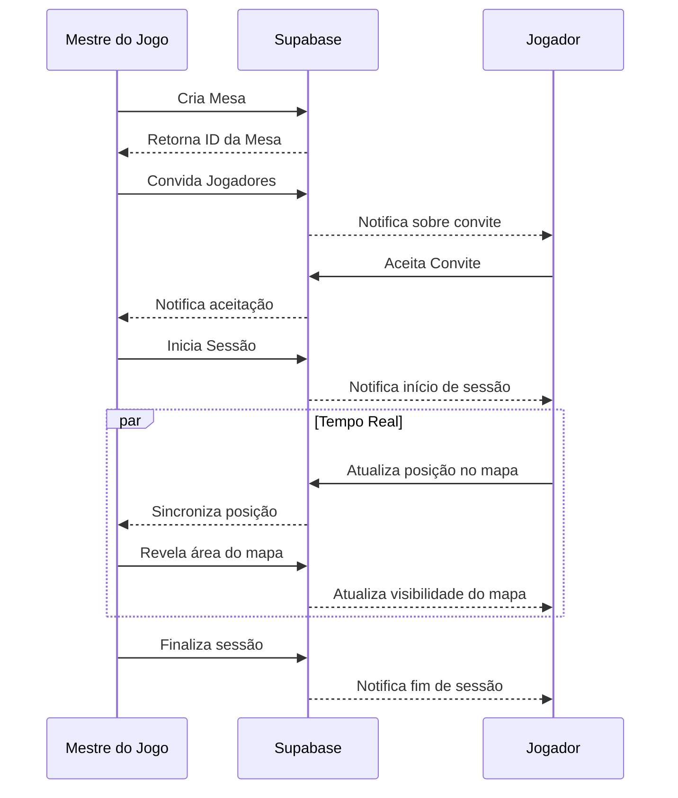
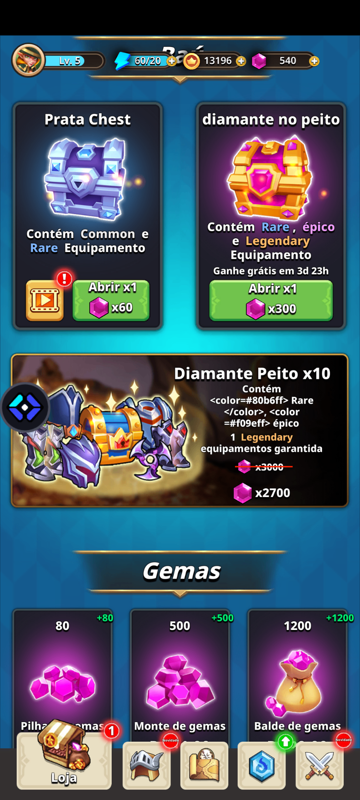

# Dungeon Master Assistant

Uma aplicação web para gerenciamento de campanhas e sessões de RPG de mesa.

## Configuração do Ambiente

### Requisitos
- Node.js v16+ e npm
- Conta no Supabase (para banco de dados e autenticação)

### Configuração das Variáveis de Ambiente

1. Crie um arquivo `.env` na raiz do projeto baseado no `.env.example`:

```
VITE_SUPABASE_URL=https://seu-projeto.supabase.co
VITE_SUPABASE_ANON_KEY=sua-chave-anon-do-supabase
```

2. Substitua os valores pelas suas credenciais do Supabase:
   - `VITE_SUPABASE_URL`: URL do seu projeto Supabase
   - `VITE_SUPABASE_ANON_KEY`: Chave anônima de API do seu projeto Supabase

Você pode encontrar essas informações no painel do Supabase em Configurações do Projeto > API.

### Instalação de Dependências

```bash
# Instalar dependências
npm install

# Iniciar o servidor de desenvolvimento
npm run dev

# Construir para produção
npm run build

# Executar testes
npm run test
```

## Sistema de Inventário

### Recursos Implementados

1. **Arrastar e Soltar**:
   - Implementado com `react-dnd` para mover itens entre inventários
   - Sincronização em tempo real via Supabase Realtime
   - Validação de permissões (apenas donos podem modificar seus itens)
   - Debounce de 500ms para evitar sobrecarga de requisições

2. **Otimização de Imagens**:
   - Conversão automática para WebP antes do upload
   - Lazy loading com placeholders via componente `ImageLoader`
   - Compressão de imagens para reduzir uso de armazenamento

3. **Paginação Infinita**:
   - Lista de mesas com carregamento infinito (10 itens por página)
   - Skeletons animados durante carregamento via TailwindCSS
   - Detecção de interseção para carregar mais itens automaticamente

### Configuração do Cron Job de Notificações

Para configurar o cron job que envia notificações de sessões agendadas:

1. **Acesse o Painel do Supabase**: Navegue até o SQL Editor.

2. **Execute o SQL para criar o cron job**:

```sql
-- Habilitar as extensões necessárias (se ainda não estiverem habilitadas)
create extension if not exists pg_cron;
create extension if not exists pg_net;

-- Criar o job para notificar sobre sessões próximas
select cron.schedule(
  'notify-upcoming-sessions',
  '*/30 * * * *', -- a cada 30 minutos
  $$
  insert into public.notifications (user_id, title, type, reference_id, reference_type, content)
  select 
    tp.user_id,
    'Sessão se aproximando',
    'session_reminder',
    t.id,
    'table',
    'Sua sessão de ' || t.name || ' começará em breve'
  from 
    public.tables t
    join public.table_participants tp on tp.table_id = t.id
  where 
    -- Lógica para determinar se a sessão está próxima
    t.weekday = to_char(now(), 'Day') 
    and t.time::time - current_time < interval '1 hour'
    and t.time::time - current_time > interval '0 minutes'
    and not exists (
      select 1 from public.notifications n 
      where n.reference_id = t.id 
      and n.type = 'session_reminder'
      and n.created_at > now() - interval '1 day'
    );
  $$
);
```

3. **Verificar o status do job**:
```sql
select * from cron.job;
```

### Schema do Banco de Dados

O sistema de inventário utiliza as seguintes tabelas:

#### character_inventory
| Coluna | Tipo | Descrição |
|--------|------|-----------|
| id | uuid | Identificador único do item |
| character_id | uuid | Referência ao personagem proprietário |
| name | text | Nome do item |
| description | text | Descrição do item |
| quantity | integer | Quantidade do item |
| weight | numeric | Peso de uma unidade do item |
| value | integer | Valor monetário (opcional) |
| type | text | Tipo do item (arma, armadura, etc) |
| rarity | text | Raridade (common, uncommon, rare, epic, legendary) |
| equipped | boolean | Se o item está equipado |
| image_url | text | URL da imagem do item |
| created_at | timestamp | Data de criação |
| updated_at | timestamp | Data da última atualização |

## Diagrama de Fluxo de Sessões



## Screenshots das Telas Principais

### Painel do Mestre


### Mapa Tático


### Chat Durante Sessão


### Sistema de Combate


### Inventário


## Licença

MIT
